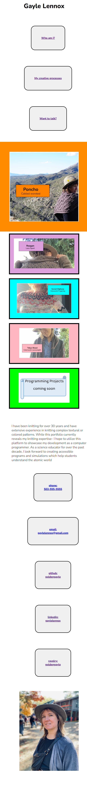

# Portfolio (Challenge #2)
## Description
This project is a landing page for my future developer portfolio. The project gave me an opportunity to practice creating a website with HTML and CSS, specifically considering how to use flexbox and media queries to have a site responsive to screen readers and different sized screens. This portfolio site currently uses knitting images as placeholders for future development projects.

## Usage
AS A USER I want to find out if Gayle is a good fit for my organization. 
<a href="https://goldengayle.github.io/portfolio/">

## Installation
N/A

## Credits
All code and images @goldengayle

## License
MIT License

Copyright (c) 2023 goldengayle

Permission is hereby granted, free of charge, to any person obtaining a copy of this software and associated documentation files (the "Software"), to deal in the Software without restriction, including without limitation the rights to use, copy, modify, merge, publish, distribute, sublicense, and/or sell copies of the Software, and to permit persons to whom the Software is furnished to do so, subject to the following conditions:

The above copyright notice and this permission notice shall be included in all copies or substantial portions of the Software.

THE SOFTWARE IS PROVIDED "AS IS", WITHOUT WARRANTY OF ANY KIND, EXPRESS OR IMPLIED, INCLUDING BUT NOT LIMITED TO THE WARRANTIES OF MERCHANTABILITY, FITNESS FOR A PARTICULAR PURPOSE AND NONINFRINGEMENT. IN NO EVENT SHALL THE AUTHORS OR COPYRIGHT HOLDERS BE LIABLE FOR ANY CLAIM, DAMAGES OR OTHER LIABILITY, WHETHER IN AN ACTION OF CONTRACT, TORT OR OTHERWISE, ARISING FROM, OUT OF OR IN CONNECTION WITH THE SOFTWARE OR THE USE OR OTHER DEALINGS IN THE SOFTWARE.

